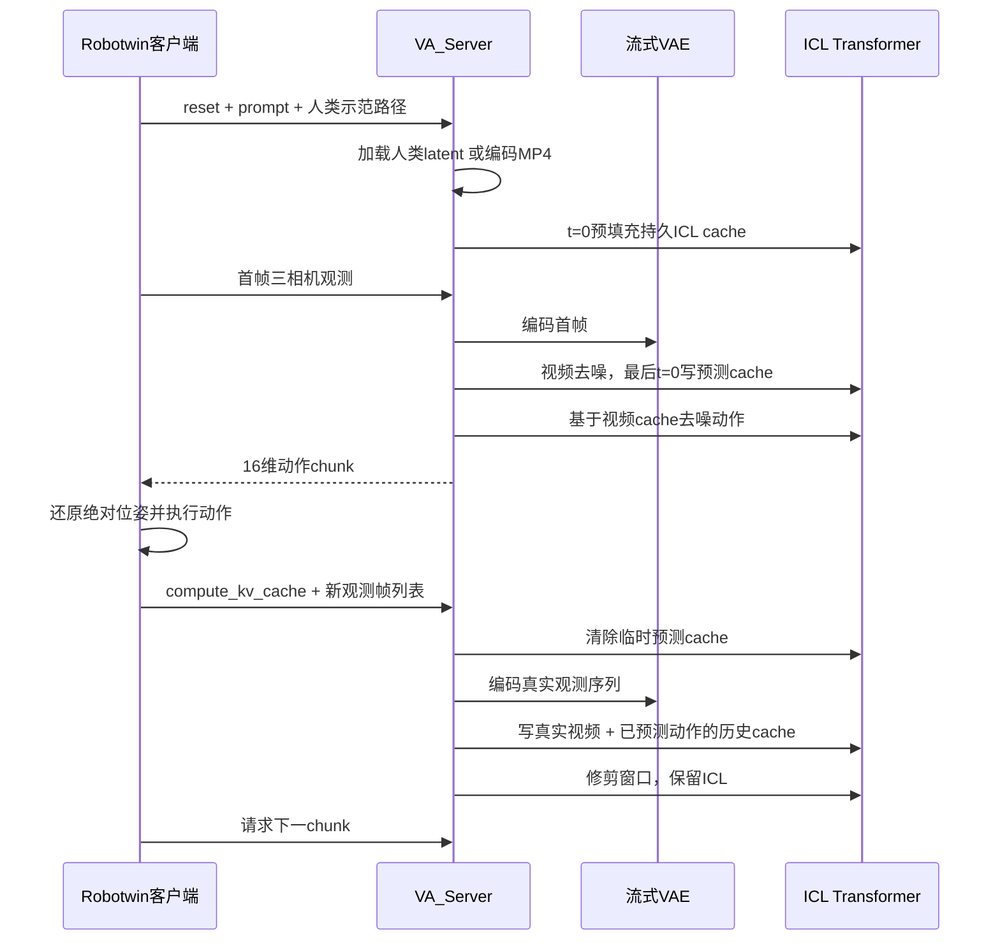

# ICL 推理流程、数据加载与闭环分析

分析基线：2026-09-18，提交 `35c0ca1`。本文聚焦 `use_icl_model=True` 的 Robotwin 服务，避免把原始模型的 `_infer/_compute_kv_cache` 与 ICL 的同名用途方法混淆。配套：[模型结构](icl_model_architecture.md)、[训练流程](icl_training.md)。

## 1. 推理的核心顺序



这是有状态的“先视频、后动作、执行后反馈”流程。人类示范只在 reset 时缓存一次，之后的动作通过预测视频和真实视频历史间接读取示范信息，模型参数不在线更新。

## 2. 服务入口与模型加载

入口 [wan_va_server.py](../wan_va/wan_va_server.py)：`main → run → VA_Server → run_async_server_mode`。启动脚本包括 [run_launch_va_server_sync.sh](../script/run_launch_va_server_sync.sh)、[launch_server.sh](../evaluation/robotwin/launch_server.sh) 和 [launch_server_multigpus.sh](../evaluation/robotwin/launch_server_multigpus.sh)。

`MODEL_PATH` 必须是包含下列组件的模型根，`resolve_model_component` 会检查子目录：

```text
MODEL_PATH/
├── transformer/     # ICL模型配置和权重
├── vae/
├── text_encoder/
└── tokenizer/
```

训练保存的 `checkpoint_step_*/transformer/` 仅含 Transformer。直接把只有这一个子目录的 checkpoint 根当作完整 `MODEL_PATH`，服务会因缺少 VAE 等组件失败。部署时需要在统一模型根下组合训练权重与匹配的基础组件；还必须核对动作统计、相机布局和模型版本兼容性。

初始化分别加载 VAE、T5 tokenizer/encoder、empty text embedding，以及 `WanICLTransformer3DModel`。模型转 BF16、应用 FSDP 并设为 eval/禁止梯度。ICL 模型即便带 MCP 权重，流式前向也不执行 MCP 辅助预测。

`WanVAEStreamingWrapper` 维护的是 causal convolution 的特征缓存，Transformer 维护的是逐层 attention K/V；二者是不同缓存，都必须在 episode reset 清理。

## 3. 当前 Robotwin 推理默认值

来源：[va_robotwin_cfg.py](../wan_va/configs/va_robotwin_cfg.py)、[shared_config.py](../wan_va/configs/shared_config.py)。

| 参数 | 默认行为 |
|---|---|
| `use_icl_model` | true |
| 相机输入顺序 | cam_high、cam_left_wrist、cam_right_wrist |
| 每相机尺寸 | `224×288`，三路 latent 沿宽度拼接 |
| 目标 latent | 48 通道，空间 `14×54` |
| chunk 大小 | 2 latent 帧 |
| 每 latent 帧动作数 | 16 |
| 视频／动作去噪 | 50 / 50 scheduler step |
| 视频／动作 SNR shift | 5 / 1 |
| 人类视频 fallback | resize 为 `320×480`，目标抽帧频率 12 fps |
| ICL RoPE 高度偏移 | 24 |
| `TARGET_TEXT_CFG` | 默认 -1：目标使用空文本 embedding |
| `ICL_CFG` | 默认 5：启用视频的 ICL CFG |
| 动作 CFG | ICL 路径不启用 |
| offload | 共享配置显式 false |

`attn_window` 在模型构造器／checkpoint 默认为 64。ICL 服务加载时没有把 `job_config.attn_window` 显式覆盖到 Transformer；实际 `_forward_stream` 和默认缓存修剪使用模型对象中的 `self.attn_window`。仅修改服务配置的窗口字段，不保证更改 ICL 模型窗口。

## 4. 客户端数据契约与会话状态

`VA_Server.infer` 支持三类消息，优先判断 reset，再判断 compute_kv_cache，最后推理。

### 4.1 Reset

```python
client.infer({
    "reset": True,
    "prompt": "任务指令，不能为空",
    "use_icl": True,
    "icl_latent_path": "/server/path/demo.pth",
    "icl_video_path": "/server/path/demo.mp4",
    "video_guidance_scale": -1,
    "icl_guidance_scale": 5,
})
```

返回业务内容为空 dict；WebSocket 包装层会附加 `server_timing`。`use_icl=False` 可关闭示范，但仍使用 ICL 模型架构。路径在服务端读取，多进程服务中参与计算的 rank 均需要能访问它们；发送的是路径字符串，不是自动上传文件。

reset 会清零 `chunk_idx`、首帧 latent、上次预测视频／动作、Transformer cache、流式 VAE cache，建立动作有效槽位和 q01/q99，并编码目标 prompt/negative prompt。非空 prompt 是当前接口要求，即使 `TARGET_TEXT_CFG=-1` 最后让目标分支使用空文本也一样。

### 4.2 请求动作

```python
client.infer({
    "obs": {
        "observation.images.cam_high": rgb_high,
        "observation.images.cam_left_wrist": rgb_left,
        "observation.images.cam_right_wrist": rgb_right,
    }
})
```

图像按 HWC RGB、数值范围 0～255 处理；首帧也可用只含一个字典的 list。返回 `action` 形状为 `[16,chunk_frames,16]`，默认 `[16,2,16]`。

首 chunk 会读取此消息的图像。后续 `_infer_icl` 不再用本消息重新编码观测，而依赖上一条 `compute_kv_cache` 写入的历史。因此不能通过“每次直接发新图像请求动作”替代反馈步骤，也不应在反馈前连续请求下一 chunk。

### 4.3 反馈观测

```python
client.infer({
    "compute_kv_cache": True,
    "obs": [camera_dict_0, camera_dict_1, ...],
})
```

反馈必须在第一次动作预测后调用。ICL 分支使用内部 `last_predicted_actions` 作为动作历史；客户端附带的 `state` 不会被这一分支重新归一化或写入缓存。若真实执行动作被裁剪、修改或被控制器改变，缓存仍代表原预测动作，这是当前闭环实现的明确边界。

同一个 `VA_Server` 对象只有一个活动 episode 状态，没有按 WebSocket client 划分缓存。多个连接不能据此当作独立并发会话使用。

## 5. 人类示范如何加载

### 5.1 评测客户端选示范

[robotwin_icl_human_videos.py](../evaluation/robotwin/robotwin_icl_human_videos.py) 为七个未见任务配置固定人类视频候选，根目录在仓库 `data/HumanGen` 下，不自动跟随训练的 `HUMAN_GEN_ROOT`。

[eval_policy_client_openpi.py](../evaluation/robotwin/eval_policy_client_openpi.py) 根据 `icl_seed + task_name的MD5片段 + episode_idx` 建立局部随机生成器，在候选中选择一段示范。它控制的是示范选择，不等于统一设置服务器去噪采样随机种子。

`resolve_icl_latent_path` 依次尝试 `human_data` 后相对路径在指定 latent 根下的镜像、原视频路径中 `human_data → human_latents` 的镜像、以及根下 `<video.stem>.pth`。找不到返回空字符串，让服务器走 MP4 fallback。

### 5.2 `.pth` 优先

`_load_or_encode_icl` 在 latent 路径存在时 `torch.load(..., map_location='cpu')`，要求 dict 包含 `latent`。可接受：

| 形状 | 解释 |
|---|---|
| `[1,C,F,H,W]` | 直接使用，batch 必须为 1 |
| `[C,F,H,W]` | 加 batch 维 |
| `[F,H,W,C]` | 需要 `latent_layout` 明确标为 `f h w c` 或 `f h w d` |
| `[F×H×W,C]` | 使用三项 latent 尺寸元数据还原 |

预计算 latent 不重复归一化。`text_emb` 若存在且为二维则补 batch 维；缺失时使用本次任务的 `prompt_embeds`。与训练 loader 相比，推理接受的格式更多、对 text/元数据完整性的验证也不完全相同；不能认为任意推理可读 `.pth` 都能直接用于训练。

### 5.3 MP4 fallback

优先 decord，失败后 imageio。按原 fps 与目标 12fps 算采样索引，去重并裁剪；源 fps 较低时不会人为补帧到严格 12fps。读取后 resize 为 `320×480`，转 `[1,3,F,H,W]` 并映射到 `[-1,1]`。

清空流式 VAE 状态，编码视频，取 posterior 的均值 mu 而不是采样，使用 `(mu-mean)/std` 归一化，再清空 VAE 状态。fallback 在内存中使用该 latent，没有自动写回新的 `.pth` 缓存；下一次 reset 仍可能重复解码编码。

训练使用文件里的人类文本，MP4 fallback 因无 `text_emb` 使用目标 prompt，因此二者的条件内容可能不同。视频抽帧、空间 resize、VAE 版本和归一化也应与离线生成 latent 的流程保持一致。

### 5.4 持久 ICL cache

`_cache_icl_context` 检查通道数与 VAE 配置匹配，构造 h 轴偏移 24 的 RoPE，timestep 全零，cache type=2，seq=0。供 attention mask 使用的 frame ID 全部设为 0，使整段示范双向可见；RoPE 仍保留示范实际时间坐标。

执行一次 `forward_latent_only(update_cache=1)`，把每层 K/V 存为持久上下文。随后清空 VAE cache，防止人类视频的因果卷积历史污染机器人首帧。整个 episode 中 ICL token 不受 observation 窗口淘汰。

## 6. 机器人观测编码

首帧 `_encode_initial_obs` 要求恰好一帧。三相机分别 resize，映射 `[-1,1]`，沿 batch 维合并后送入流式 VAE；取 mu 并归一化，再把相机结果沿宽度拼接，形成 `[1,48,1,14,54]`。

后续 `_encode_obs` 接收图像字典列表，用同一 `WanVAEStreamingWrapper` 延续 causal convolution cache，得到新的 latent 帧。第一次反馈会在新编码结果前拼上 `init_latent`。VAE 状态和图像序列必须按实际执行顺序连续更新。

默认采用三相机同尺寸的横向布局。`robotwin_tshape` 在 `_encode_obs` 有另外分支和第二个 VAE wrapper，但 ICL 首帧函数固定使用同尺寸横向拼接；不能仅修改 `env_type` 就认定该非默认组合已完整适配。

观测字典里的 `observation.state` 在 ICL 推理没有作为额外状态 token 输入。模型的机器人条件主要是图像历史、动作历史和示范／文本。

## 7. 文本、ICL CFG 与序列打包

目标 prompt 通过 tokenizer/T5 在线编码，最长 512 token，有效部分外的 embedding 补零。negative prompt 默认空字符串，若加载了仓库 empty embedding，则覆盖在线计算的 negative embedding。

| 条件 | `_reset_icl` 的行为 |
|---|---|
| `video_guidance_scale < 0` | 目标视频和动作使用 empty/negative embedding |
| `use_icl` 且 `icl_guidance_scale > 1` | 视频启用 ICL CFG，优先于目标文本 CFG |
| 未启用 ICL CFG 且 `video_guidance_scale > 1` | 视频启用目标文本 CFG |
| 其余情况 | 视频不做两分支 CFG |
| 动作 | 始终不打包 CFG 分支 |

`_pack_icl_cfg` 沿时间维把同一 noisy video 复制两次，仍保持 batch=1；grid 也复制，逻辑 seq 分别为 0/1。文本沿 token 维拼接，并用相同 seq ID 隔离。输出沿 token 维拆为 cond/uncond：

```text
v = v_uncond + scale*(v_cond-v_uncond)
```

ICL cache 只有 seq=0，所以 seq=1 不能直接读示范。ICL CFG 时两分支目标文本相同；目标文本 CFG 时第二分支文本为空。两类 guidance 当前没有同时组合成三个或四个分支。

默认 `TARGET_TEXT_CFG=-1, ICL_CFG=5` 表示目标分支空文本、通过视频示范做 guidance，并不代表人类示范的 cross-attention 文本也被置空。加载的人类 `.pth` 仍可携带独立文本。

一个重要细节：历史视频也按 CFG 复制为 seq=0/1，而历史动作只写 seq=0。因此 ICL CFG 的两条长期历史不仅有“是否存在 ICL”的差别，也有动作历史可见性差别；不能把实现严格等同于所有其他条件完全一致的纯 ICL 消融。

## 8. 一次动作 chunk 的生成

### 8.1 初始化

`_infer_icl` 首 chunk 编码 `init_latent`，随后随机生成视频 `[1,48,2,14,54]` 和动作 `[1,30,2,16,1]`。另消耗一次 `randn_like(actions)` 的随机数，以保持与目标 rollout 随机数消费顺序一致；这不是第二份要预测的动作。

### 8.2 先去噪视频

视频 scheduler 配置 50 step，再显式追加一个 t=0 前向，总计默认 51 次视频 Transformer 调用。前 50 次执行 Euler 更新：`x_next=x+velocity*(sigma_next-sigma)`；仅最终 t=0 调用 `update_cache=1`，缓存最终视频的 K/V，cache type=1。

首 chunk 每步把第一个 latent 帧固定为真实首帧，且所有 CFG 分支对应位置的 timestep 都设为零；Euler 更新后也恢复首帧，避免其漂移。最终 t=0 前向用于写 cache，不再更新 latent。

### 8.3 再去噪动作

动作执行 50 step，每次输入前把无效动作通道清零。每次 `forward_action_only(update_cache=0)` 可读视频预测 cache、历史视频／动作，但不能直接读 ICL。当前动作去噪没有额外末尾 t=0 缓存步骤，也不使用 action guidance scale。

最终无效通道再清零。返回动作与 `last_predicted_actions` 分开保存；首 chunk 的历史副本第一个 latent 帧全部设为零，匹配训练的补零历史。返回动作的这一块本身没有被设为零，所以客户端必须遵守跳过首块的协议。

`postprocess_action` 先逆 q01/q99 归一化，再按 `[0..6,28,7..13,29]` 取出双臂 16 维。这里不把相对位姿还原成绝对位姿，也不对预测四元数做单位化；这些由 Robotwin 客户端执行。

## 9. Robotwin 执行与真实观测反馈

客户端在 episode 开始记录左右臂初始 xyz/quaternion/gripper。每条相对动作的位置加初始位置，旋转做 `Rinit × Rrelative`，之后单位化左右四元数，再调用 `TASK_ENV.take_action(..., action_type='ee')`。

首 chunk 跳过 `action[:,0,:]`，因此默认实际执行 16 个动作；后续 chunk 执行全部 `2×16=32` 个动作。每执行 4 个动作采一次图像：首 chunk 反馈 4 帧，之后通常反馈 8 帧，以配合 temporal rate=4 的流式编码。

`_compute_icl_kv_cache` 顺序如下：

1. `clear_prediction_cache(-1)` 删除预测视频，暂不裁剪真实历史窗口。
2. `_encode_obs` 编码反馈图像；首 chunk 再拼上初始 latent。
3. 用内部归一化的 `last_predicted_actions`，避免逆归一化再归一化的往返误差。
4. t=0 写入真实视频，cache type=0。
5. t=0 写入动作历史，cache type=0，`clean_window_cache=True`。
6. 清除残留预测并按窗口修剪 observation，`chunk_idx += 1`。

视频 frame ID=`2×chunk_idx`，动作 frame ID=`2×chunk_idx+1`；RoPE 时间起点则是 `frame_chunk_size×chunk_idx`。两者单位不同。窗口 64 对完整历史大致容纳 32 个视频+动作 chunk 对，具体还受窗口边界与 padding 影响。

用真实视频替换预测视频能让后续动作依据环境实际变化，但动作历史仍是模型原输出，不是测量到的真实动作。服务没有检查反馈帧数必须与 chunk 对齐，缺帧／多帧会影响 VAE 时间和历史长度，需要客户端保证契约。

## 10. 分布式、网络与日志

[server_utils.py](../wan_va/utils/server_utils.py) 让 local rank 0 接收 WebSocket 请求，通过广播让其他 rank 执行同一个 `model.infer`。当前 rank/local_rank 断言及按 local_rank 选择 server 的方式主要面向单机分片服务，不能直接当成已经验证的多机推理服务。

[websocket_policy_server.py](../wan_va/utils/Simple_Remote_Infer/deploy/websocket_policy_server.py) 使用 msgpack/NumPy 编解码，连接后先发送 metadata，返回中附带 `infer_ms` 等计时，提供 `/healthz`。名字含 async，但实际模型推理是 handler 内的同步调用，不代表具备多个 episode 的并行调度和缓存隔离。

评测的 `launch_server_multigpus.sh` 是在 8 张卡上启动 **8 个独立的单卡服务**，各有端口和进程组，不是一个 8 卡 FSDP 服务。通用 `run_launch_va_server_sync.sh` 则默认一个 8 进程服务，两者用途不同。

通用启动脚本中 `PORT` 变量当前没有拼入 Python 命令；要改服务端口，应传 `--port`。例如在项目根、正确 Python 环境下：

```bash
MODEL_PATH=/path/to/complete-model-root \
NGPU=1 CONFIG_NAME=robotwin \
bash script/run_launch_va_server_sync.sh --port 29056
```

服务端没有复用训练新增的时间子目录和 `add_file_logger`。评测多服务启动脚本通过 shell `>log_file 2>&1` 收集完整 stdout/stderr；不要期待推理自动生成训练样式的 `train.log`。

## 11. 训练和推理的对应关系

| 方面 | 训练 | ICL 推理 |
|---|---|---|
| 机器人视频 | 预计算 `.pth` | 真实 RGB 经流式 VAE 编码 |
| 人类示范 | 必须有配对 `.pth` | `.pth` 优先，MP4 fallback |
| 文本 | 预计算目标／示范 embedding | 目标 T5 在线编码，示范优先文件文本 |
| 视频／动作 | noisy/condition 双流并行训练 | 先视频去噪，再动作去噪 |
| ICL 可见性 | 视频可见，动作不可直接见 | 同一约束，通过 cache type 区分 |
| 首帧历史动作 | 一个 latent 帧的零动作，仍有有效通道监督 | 首块不执行，历史副本清零 |
| 无效动作槽位 | noisy input 保留随机噪声，仅 loss mask | 每步输入和最终结果清零 |
| 时间 chunk/window | 默认随机 1～4 / 4～64 | 默认固定 2 / 模型窗口64 |
| 条件噪声 | 部分机器人条件视频加噪 | 真实观测和 ICL 以 t=0 缓存 |
| MCP | 四路未来视频辅助 loss | 流式前向不执行 |
| 相对动作参考点 | 训练切片对齐后的第一条 state | 客户端 episode 初始位姿 |

最后一项要求训练切片、状态参考点和部署坐标定义一致；对于任意切片或任意机器人数据，不能仅凭张量维度相同就认为训练／部署语义已经对齐。

## 12. 已确认的边界与待验证风险

| 项目 | 当前代码事实及影响 |
|---|---|
| `generate()` / `robotwin_i2va` | 仍直接调用旧 `_infer`；旧 reset 的缓存预分配被 ICL dispatch 绕过，旧前向接口也不同，不应作为已验证 ICL 离线生成入口 |
| `action_guidance_scale`、`video_exec_step` | ICL 主路径没有使用这些参数控制采样，不要根据名称推断其生效 |
| 请求中的 prompt/guidance | 关键文本及 guidance 在 reset 固化；普通 infer 附带这些字段不会重置条件 |
| `enable_offload=True` | ICL 首帧把视频放在 `self.device`，未实现完整 CPU VAE 来回搬运，非默认 offload 组合可能设备不一致 |
| T-shape 非默认布局 | 初始观测和后续观测路径不完全一致，需专门适配测试 |
| 预测视频可视化 | ICL `infer` 返回 action，不返回 video；`save_visualization` 不会自动让该路径生成预测视频 |
| 长示范 | 持久 KV 不淘汰，dense mask／长序列可能显著增大内存和延迟 |
| 状态误用 | 少 reset、少反馈、重复 feedback 或多个 client 交替调用均可破坏会话顺序 |
| 完整可复现性 | 当前入口没有统一去噪随机种子接口，示范选择 seed 不覆盖模型噪声 |

当前源码测试 [test_icl_server.py](../tests/test_icl_server.py) 验证动作逐步清零、末尾不额外做 action 前向、首块缓存副本、复用原预测动作、CFG 不复制动作历史；[test_icl_model.py](../tests/test_icl_model.py) 验证底层可见性与缓存。它们主要使用小模型或 mock，不证明完整权重的闭环成功率、目标硬件性能及上述非默认组合可用。
