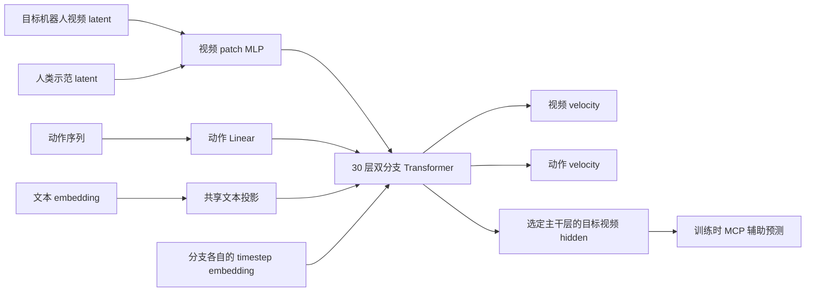

# ICL 模型实现分析

分析基线：2026-09-18，仓库提交 `35c0ca1`。本文解释当前代码的实际行为；默认尺寸以 `WanICLTransformer3DModel` 及 Robotwin 配置为例，加载其他 checkpoint 时应以其 `transformer/config.json` 为准。本文不把代码注释或模型命名当作实验效果的证明。

配套文档：[训练与数据加载](icl_training.md)、[推理与数据加载](icl_inference.md)。

## 1. 模型在项目中的位置

主要实现位于 [icl_model.py](../wan_va/modules/icl_model.py)。`WanICLTransformer3DModel` 同时实现训练前向和带 KV cache 的流式推理。虽然类说明写的是 inference model，实际 `forward(train_mode=True)` 会进入 `forward_train`。

[model.py](../wan_va/modules/model.py) 保留了原始 `WanTransformer3DModel`；ICL 模型仅复用其中的时间／文本嵌入和 RoPE 等组件，不能把两份模型的缓存接口、MCP 初始化逻辑或前向行为混为一谈。当前训练入口显式用 `icl_model=True` 加载模型；Robotwin 服务通过 `use_icl_model=True` 选择它。

| 组件 | 职责 | 关键入口 |
|---|---|---|
| `WanICLTransformer3DModel` | 嵌入、序列组织、mask、主干、输出、缓存元数据 | `forward_train`、`_forward_stream` |
| `WanICLTransformerBlock` | 视频／动作双分支的 self-attention、cross-attention、FFN | `forward` |
| `WanICLAttention` | 分模态 Q/K/V 投影、注意力执行、逐层 K/V 缓存 | `_project`、`forward` |
| `ICLAttentionBackend` | 训练／推理可见性规则与硬件后端 | `build_training_self_mask`、`build_self_mask` |
| `WanTimeTextImageEmbedding` | diffusion timestep 与文本投影 | [model.py](../wan_va/modules/model.py) |
| `WanRotaryPosEmbed` | 时间、高度、宽度三轴 RoPE | [model.py](../wan_va/modules/model.py) |

## 2. 总体信息流



这里的 ICL 是把人类示范作为上下文 token 使用，不是在每次推理时更新参数。人类示范与机器人视频共用视频专家。动作专家有独立投影和 FFN，没有学习路由器、top-k expert 选择或负载均衡损失；`attn_moe=True` 在这里表示固定的模态分工。

最重要的约束是：**目标视频可以直接读 ICL，动作不能直接读 ICL。** 动作通过已融合示范信息的视频表示间接获得示范条件。这是 attention mask 的硬约束，不是依靠损失自行学出的偏好。

## 3. 张量和默认尺寸

约定 `B` 为 batch，`F` 为 latent 帧数，`H/W` 为 latent 空间尺寸，`A` 为每 latent 帧的动作数量，`D=3072` 为默认模型宽度。

| 输入／中间量 | 形状或默认值 |
|---|---|
| 视频 latent | `[B, 48, F, H, W]` |
| 人类 latent | `[B, 48, Fi, Hi, Wi]`，时长／分辨率可与目标不同 |
| 动作 | `[B, 30, F, A, 1]` |
| 文本 | `[B, Ltext, 4096]` |
| 视频 patch | `(1,2,2)`；每 token 输入 `48×1×2×2=192` 维 |
| 视频 token 数 | `Lv=(F/pf)(H/ph)(W/pw)` |
| 动作 token 数 | `La=F×A`；每 token 是一条 30 维动作 |
| 主干 | 30 层，24 heads，head dimension 128 |
| 视频／动作 FFN | 默认内部维度均为 14336 |
| 主干输出视频 | `[1, F×H×W, 48]`，patch 子位置展开后的序列 |
| 主干输出动作 | `[1, F×A, 30]` |

当前训练和推理前向都要求 `B=1`。多卡扩大的是分布式全局 batch；CFG 也没有绕过此限制，而是沿序列／时间轴打包两条逻辑序列。

Robotwin 默认每个相机 `224×288`，VAE 空间下采样 16 倍，三个相机沿宽度拼接后得到 `H=14, W=54`。每个 latent 帧有 `7×27=189` 个视频 token。默认推理 chunk 为 2 帧：视频 378 token，动作 `2×16=32` token。

## 4. 嵌入与位置编码

`_embed_stream` 对视频先按 patch 展平，再经 `patch_embedding_mlp` 映射至 `D`；动作直接把 `[F,A,1]` 展为 token 并经过 `action_embedder`。模型还注册了 `patch_embedding: Conv3d`，但当前这两条前向均未调用它，保留目的是 checkpoint schema 兼容。

视频与动作各有 timestep embedder。逐帧 timestep 被复制到该帧的所有 token，生成 `temb` 和 `[B,L,6,D]` 的 block 调制参数。动作 condition embedder 是视频 condition embedder 的深拷贝；当前文本实际只通过视频侧 `condition_embedder.text_embedder` 投影，动作侧副本的文本投影未进入当前计算图。

每层的六组调制量分别用于 self-attention 前的 shift/scale、self-attention residual gate、FFN 前的 shift/scale、FFN residual gate。输出头另用两组 shift/scale。

[get_mesh_id](../wan_va/utils/utils.py) 产生 `[4,L]` 的网格：前三行是 `f,h,w`，第四行是模态标记。RoPE 只读取前三行。ICL 的高度坐标增加 `icl_rope_h=24`，用于位置区分；是否可见仍由 mask 决定，不能把坐标偏移理解成安全隔离。

训练与 ICL 推理的动作网格都传入 `action=False`：不会启用该工具函数中可选的分数时间偏移。动作子步用高度坐标区分，视频／动作先后次序另用 frame ID 表达。

`_apply_rotary_emb` 在 NPU 上用 float32 构造复数，在其他设备上用 float64，再转回输入 dtype。RoPE 频率是非持久 buffer；模型加载后的 `.to(dtype=...)` 也会转换这些 buffer。

## 5. 一个 Transformer block 做什么

视频与动作 hidden 分别经历：

1. FP32 LayerNorm，时间条件 shift/scale，再转换回 hidden dtype。
2. 模态各自生成 Q/K/V，沿 token 维拼到同一次 self-attention 中。
3. 注意力结果按视频／动作长度拆开，经过各自 output projection 和 gate residual。
4. 各自的 query 对文本进行 cross-attention；文本 K/V 共享，结果 residual 相加。
5. 各自 FP32 LayerNorm、时间调制、独立 FFN、gate residual。

Self-attention 的视频和动作 Q/K/V、Q/K RMSNorm、输出投影各自独立。Cross-attention 中动作 Q/output 独立，动作 K/V/norm 属性则是文本公共投影的别名，保留在 state dict 中以兼容 checkpoint。

`fully_share=True` 或 `attn_moe=False` 会直接报错。虽然构造器允许传入不同 `action_inner_dim`，动作 timestep embedder 仍按视频宽度深拷贝；任意改小动作宽度不能保证可运行，当前默认同宽配置才是已覆盖路径。

## 6. 训练序列及可见性

`forward_train` 的逻辑顺序为：

```text
视频 hidden: [目标 noisy video | 目标 condition video | ICL video]
动作 hidden: [noisy action | clean action]
注意力顺序:  [上述所有视频 token | 上述所有动作 token | padding]
```

总长度 `2Lv + Li + 2La + P`。代码使用 `P=128-(L%128)`，所以整除 128 时仍会额外补 128 token。padding 的训练元数据均为 `-1`。

`noise_ids=0` 表示要预测的 noisy 流，`noise_ids=1` 表示条件流。条件视频有概率再次加噪，因此名称中的 clean 不保证其数值完全无噪；mask 中的 clean 更准确地表示 teacher-forcing 条件分支。

时序 ID 为：

```text
video_frame_id = floor(video_grid_time / chunk_size) * 2
action_frame_id = floor(action_grid_time / chunk_size) * 2 + 1
```

因此视频 chunk k 是 `2k`，同 chunk 动作是 `2k+1`。这使动作可读同 chunk 的条件视频，而视频不能读同 chunk 的条件动作。

对同一训练样本的非 ICL token，可见性如下，还需满足窗口 `abs(q_frame-k_frame) <= window`：

| Query | Key | 可见条件 |
|---|---|---|
| condition | condition | `key_frame <= query_frame` |
| noisy | condition | `key_frame < query_frame` |
| noisy | noisy | `key_frame == query_frame` |
| condition | noisy | 不可见 |

这意味着 noisy video 不可直接读取同 chunk 的 clean video 答案；noisy action 可读更早时序 ID 的同 chunk condition video。一个 chunk 内同 noisy 流双向可见，而不是逐 token 自回归。

ICL 附加规则不受上述时间窗口限制：目标视频可见所有同样本 ICL token；ICL token 之间双向可见；ICL 不可见目标视频和动作；动作不可见 ICL。

训练 self-attention 的 `seq_ids` 对有效 token 都为 0，ICL 通过独立 `icl_ids` 标识。Cross-attention 另外使用 `cross_seq_ids`：目标视频／动作为 0，人类示范为 1，对应拼接的目标文本／示范文本。不能把两种 sequence ID 混为一谈。

## 7. MCP 辅助预测分支

入口为 `_forward_training_mcp`，目标偏移由 [train.py](../wan_va/train.py) 和 [mcp.py](../wan_va/mcp.py) 组织。

默认从主干第 `3,11,19,29` 层收集目标 noisy+condition 视频 hidden，层号从 0 开始，不收集 ICL hidden。沿通道拼接成 `4D`，经 `mcp_mlp_hidden` 融合回 `D`。

每个辅助分支分别：

1. 将未来偏移的 noisy latent 经共用视频 embedder 编码。
2. 把融合后的主干 noisy hidden 与未来 noisy hidden 拼成 `2D`，用该分支的 Linear 投影回 `D`。
3. 拼接融合后的主干 condition hidden，并使用主干最终动作 hidden。
4. 执行该分支的一组双分支 block；默认四组，每组一层，各组独立，没有级联预测。
5. 用共用视频输出 norm/projection 预测未来 latent 的 velocity。

默认未来偏移为 `1,3,5,7` 个 chunk，损失系数为 `0.5,0.25,0.15,0.1`。尾部越界部分复制最后帧占位，但由 valid mask 排除出损失。

MCP 的 RoPE 使用未来时间坐标，mask 中的时序 ID 仍用原目标 chunk 对齐。MCP 自身没有显式 ICL token；示范影响通过主干 hidden 进入。没有 detach 主干 hidden，因此辅助损失会反向更新主干。

当前 ICL `_forward_stream` **不执行 MCP**。服务仍可能加载并分片其权重，所以没有 MCP 推理计算不等于没有 MCP 参数显存。`disable_mcp_modules` 只修改布尔值，不删除这些模块。原始 `model.py` 中从主干复制 MCP 权重的初始化方法，不应套用到当前 ICL 类上。

## 8. 推理 KV cache 与 mask

每一层 `attn1` 缓存旋转后的 K 和 V；cross-attention 没有持久缓存文本 K/V。模型同时维护与缓存 token 一一对应的元数据：

| 元数据 | 含义 |
|---|---|
| `type_ids_cache` | 0 视频，1 动作，2 已缓存 ICL；普通 padding 为 -1 |
| `seq_ids_cache` | CFG 逻辑序列归属 |
| `frame_ids_cache` | 视频／动作 chunk 的交替时序 ID |
| `cache_type_ids_cache` | 0 实测历史，1 临时预测，2 持久 ICL |

`type_ids` 与 `cache_type_ids` 都出现 0/1/2，但语义不同：一个动作可以是 type 1、cache type 0。

每次 `_forward_stream` 把旧 K/V 与当前 K/V 拼接供注意力读取；只有 `update_cache` 为真才持久保存。当前 query 是视频时，可跨窗口读取相同 seq 的 ICL；动作不可以。普通 K/V 必须同 seq、不是 padding，且在窗口内。

推理 mask 没有训练时的 noise IDs，也没有单独的严格因果条件；时序正确性来自服务调用顺序和缓存只包含历史／当前 chunk 的事实。因此，调用方错误地提前写入未来数据，不能依赖该 mask 自动纠正。

`clear_prediction_cache` 删除全部 cache type 1，保留 type 2，再按最近 observation 的 `max_frame_id+1` 修剪 type 0。默认窗口 64 的单位是交替的视频／动作 chunk ID，不是原始 RGB 帧。窗口 -1 关闭窗口限制；推理 mask 的 0 则表示只看同 frame ID，不能照搬训练配置中“0 代表随机采样”的解释。

每次前向也按 128 补齐。缓存 padding 继承所属 cache type，方便整体清理；`cache_counts()` 排除了 `frame_id=-1` 的 padding，不能直接据此计算实际分配的缓存长度。ICL padding 的 type 也被 `_append_metadata` 改为 2，但 seq 仍为 -1，真实 query 无法读取它。

## 9. 后端、计算与内存

CUDA 走 `BlockMask + torch.compile(flex_attention)`；其他设备走 dense bool mask 和 `scaled_dot_product_attention`，共用同一组可见性谓词。`*_flash` mode 名称只是同一前向的别名，不代表另外实现了一套 FlashAttention 算法。

Dense mask 大小随 `Lq×Lk` 增长，训练时大致随 `(2Lv+Li+2La)^2` 增长；NPU／CPU 分支不能仅根据小模型测试推断长视频训练显存可承受。半精度注意力输入会统一到 value dtype，非 FP16/BF16 输入会转换成 BF16。

默认 30 层、24×128 heads、BF16 下，全部层 K/V 的理论存储是每 token `30×2×3072×2 = 368640` 字节，约 360 KiB，尚未包括临时拼接、padding、激活和模型权重。长度为 Fi 的 `320×480` 人类视频 latent 有约 `150Fi` 个 ICL token；长示范会形成较大的持久开销。FSDP 分片权重，并未在本实现中把 KV cache 按 rank 分片。

## 10. 实现边界与阅读注意事项

| 观察 | 含义 |
|---|---|
| cache 元数据只有一套，而逐层字典以 `cache_name` 索引 | 当前固定 `pos` 工作流可用；不能当作多会话缓存隔离 API |
| 训练 mask 存入各 block 的 attention 实例 | MCP 后续构建自己的 mask，不覆盖主干实例持有的 mask，有利于 activation checkpoint 重算 |
| `requires_grad_(True)` 覆盖整个模型 | 不等于所有参数都有梯度；兼容性 Conv3d、未用文本副本等不参与当前前向 |
| temporal patch 默认 1 | timestep 复制／推理网格等逻辑不是任意 temporal patch 配置的通用实现 |
| ICL condition 无直接重建输出损失 | 由目标视频、动作及 MCP 目标间接训练示范表示 |
| 返回 tensor／tuple | `return_dict=True` 会报错，不完全遵循所有 Diffusers pipeline 的接口习惯 |

## 11. 验证依据与源码导航

[test_icl_model.py](../tests/test_icl_model.py) 覆盖训练 mask、缓存生命周期、窗口边界、padding、CFG sequence 隔离、全遮挡行和小模型 forward/backward。默认 checkpoint schema 测试检查 1880 个 state dict 项；这不是 1880 个彼此独立参数，别名也会进入 state dict。

[test_mcp.py](../tests/test_mcp.py) 验证未来平移和 valid mask；[test_training_alignment.py](../tests/test_training_alignment.py) 验证损失和输入对齐；服务侧缓存使用见 [test_icl_server.py](../tests/test_icl_server.py)。测试覆盖的是特定逻辑，不能替代完整 checkpoint、实际 GPU/NPU、多机吞吐和机器人闭环成功率验证。

阅读顺序建议：`forward_train` → `build_training_self_mask` → `WanICLTransformerBlock.forward` → `_forward_training_mcp` → `_forward_stream` → `clear_prediction_cache`，再结合两份流程文档追到数据与服务调用方。

## 12. 本次分析的验证记录

对 ICL model/dataset/server、training alignment、MCP、dataset index/mixture、Robotwin action、LeRobot action 共九个测试文件进行了 CPU 逻辑验证，筛选条件为 `not cuda and not npu`。首次结果为 63 通过、1 失败、17 个设备用例未选择；失败来自缺少默认 `data/HumanGen` 下的动作统计。用训练脚本一致的 `HUMAN_GEN_ROOT=/mnt/sfs_turbo/public/datasets/HumanGen` 单独复核该用例后通过，因此选定的 64 项均得到通过结果。

训练解释器没有安装 pytest，本次从已有环境临时隔离复制纯 Python 测试工具使用，没有修改训练依赖或业务实现。另检查了三份文档的本地链接及代码围栏。未运行完整规模训练、真实 GPU/NPU attention 测试、跨节点服务或 Robotwin 环境闭环，文中的性能风险属于根据代码结构推导，不是实测 benchmark。
