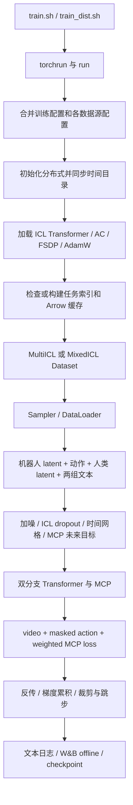

# ICL 训练流程与数据加载分析

分析基线：2026-09-18，提交 `35c0ca1`。以当前 `robotwin_train` 为主，同时说明多数据集行为。配套：[模型结构](icl_model_architecture.md)、[推理流程](icl_inference.md)。以下区分代码保证的行为和需要实际数据／硬件验证的条件。

## 1. 训练全链路



训练阶段不在线解码 RGB 视频，不加载 VAE 或 T5 编码模型。它使用预先生成的 `.pth` latent／文本 embedding，再从 LeRobot parquet 读取动作与状态。完整数据预处理管线并不包含在这个训练入口中；[create_lerobot_latent_view.py](../script/create_lerobot_latent_view.py) 可用于构造与已有 latent 对齐的数据视图，但不能据此假定原始视频会在训练时自动编码。

## 2. 启动和配置的实际优先级

入口：[train.sh](../script/train.sh)、[train_dist.sh](../script/train_dist.sh)、[train.py](../wan_va/train.py) 的 `main/run/_build_dataset_sources`。

`CONFIG_NAME` 决定顶层训练配置，`DATASETS` 决定实际加载哪些数据源，两者不是同一个开关。例如仅设置 `CONFIG_NAME=oxe_train` 而不修改脚本默认 `DATASETS=robotwin:1.0`，仍会选择 Robotwin 数据源。

Robotwin 配置按 `va_robotwin_cfg → zerowam_train_cfg → va_robotwin_train_cfg` 依次覆盖，再由 `run` 应用非空 CLI 参数。各数据源从 `TRAIN_DATASET_CONFIGS` 单独深拷贝，保留自己的相机、路径、动作映射、manifest；共享主配置的 empty embedding、初始化进程数、目标文本 dropout、rank 和索引开关。

`--dataset-path`、`--icl-manifest-path`、`--human-latent-path`、`--robot-latent-path` 只允许单数据源时覆盖；混合训练传入这些选项会报错，避免一个路径误作用于所有集合。

| 配置 | 当前 Robotwin 默认值／来源 |
|---|---|
| 每卡 batch / 梯度累积 | `1 / 1`，模型明确限制每卡 batch 为 1 |
| 学习率 / warmup | `1e-4 / 200`，之后保持常数 |
| AdamW | betas `(0.9,0.95)`，weight decay `0.01`，eps `1e-8` |
| 训练步数 / checkpoint 间隔 | `50000 / 1000` |
| 参数计算 dtype / 梯度归约 dtype | BF16 / FP32 |
| 梯度裁剪 / 跳步阈值 | max norm `1.0`；非有限或 norm 大于 `20×max_norm` 时不更新权重 |
| `init_worker` / `load_worker` | `1 / 16`，前者构建任务 dataset，后者执行 DataLoader |
| 视频 / 动作 / MCP SNR shift | `5 / 1 / 10` |
| chunk | `frame_chunk_size=0` 表示每个 batch 随机选 1～4 |
| attention window | `attn_window=0` 表示每个 batch 随机选 4～64 |
| 目标文本 dropout / ICL dropout | `0.4 / 0.1`，独立抽样 |
| 条件视频加噪概率 | `0.5`，timestep index 在完整训练区间随机采样 |
| W&B | 默认开启、offline；`WANDB_MODE` 可覆盖，`--disable-wandb` 可禁用 |

多卡默认有效 batch 为 `world_size × 1 × gradient_accumulation_steps`。序列时长不同意味着即使样本数相同，token 数和显存仍不同。Sampler 固定 seed=42 不等于整个训练可完全复现：入口没有统一设置 Python/NumPy/Torch 的全局随机种子。

当前两个训练脚本均设置 `HF_HOME` 和 `HF_DATASETS_CACHE`。单机脚本默认 8 卡，集群脚本读取 `MA_NUM_HOSTS/VC_TASK_INDEX/VC_WORKER_HOSTS/MA_NUM_GPUS`，或相应手动变量。分布式初始化写为 NCCL；Ascend 通过 `transfer_to_npu` 适配，脚本同时提供 HCCL 环境变量。

## 3. 数据文件契约

默认脚本设置的根为 `HUMAN_GEN_ROOT=/mnt/sfs_turbo/public/datasets/HumanGen`，Python 配置在变量缺失时会退回仓库 `data/HumanGen`。

```text
HumanGen/
├── robotwin_data/
│   ├── meta/action_stats.json
│   ├── meta/action_transform.yaml        # 若集合级配置存在
│   └── <task>/
│       ├── meta/info.json
│       ├── meta/episodes.jsonl
│       ├── meta/...                     # LeRobot 元数据及可选任务级动作配置
│       ├── data/chunk-*/episode_*.parquet
│       ├── latents/chunk-*/<camera>/episode_<id>_<start>_<end>.pth
│       └── .cache/next_forcing/valid_metas_<hash>.json
├── icl_configs/ICL_config_robotwin.json
└── human_latents/robotwin/run_*/.../*.pth
```

若 `robot_latent_path` 非空，任务 latent 路径改为 `<robot_latent_path>/<task>/latents`，否则就在任务目录内。`repo_id` 在这里通常是绝对本地任务路径：虽然父类代码写了 `HF_LEROBOT_HOME / repo_id`，绝对右操作数会使结果仍是本地任务路径，不能据此认定数据一定从 HF 默认目录加载。

机器人单相机 `.pth` 至少要包含 `latent`、`latent_num_frames`、`latent_height`、`latent_width`、`frame_ids` 和可用文本 embedding。`latent` 按 `[F×H×W,C]` 还原；代码按第一相机的 `frame_ids` 做动作对齐，默认各相机时间范围和帧数一致，没有跨相机自动重采样。

人类 `.pth` 要求 `latent`、三项形状元数据和 `text_emb`。支持 `[F×H×W,C]` 或 `[48,F,H,W]`，检查帧和空间形状。这里的数据已是模型归一化后的 Wan latent，不再套一次 VAE mean/std。平铺格式的通道数没有同样显式的 48 通道检查，错误会在后续模型投影暴露。

## 4. 从任务集合到有效训练样本

实现：[icl_lerobot_latent_dataset.py](../wan_va/dataset/icl_lerobot_latent_dataset.py)、[lerobot_latent_dataset.py](../wan_va/dataset/lerobot_latent_dataset.py)。

### 4.1 发现任务与排除评测集

递归发现 `info.json` 并取其任务根，排序后排除配置中的 held-out 任务及 `<task>-<variant>` 名称。Robotwin 明确排除以下七个任务：

`place_object_scale`、`stamp_seal`、`open_microwave`、`move_stapler_pad`、`place_bread_basket`、`place_empty_cup`、`stack_blocks_three`。

默认要求最终任务数为 43，不符合即报错。直接构造 `ICLLeRobotLatentDataset` 也会再检查排除规则，不只是顶层过滤。这保证配置层面的任务隔离，但不等于对数据内容重复进行了语义去重。

### 4.2 建立机器人样本索引

`LatentLeRobotDataset` 读取 LeRobot metadata，仅选具有 `action_config` 的 episodes，构建所选 episode 在 Arrow 数据中的偏移。稀疏 episode ID 通过 `episode_position` 转换，而不是直接拿 ID 索引紧凑数组。

每条 `action_config` 的 `start_frame/end_frame` 构成一个候选样本。`_check_meta` 要求所有相机 latent 文件存在，才把它加入 `new_metas`。这一步检查文件存在性，不会完整解码和验证每个 latent。

`_latent_file` 先用当前 episode/区间查找；转换数据带 `source_episode_index/source_frame_start/source_frame_end` 时，也会查找原始 episode 命名。source fallback 的 chunk 按 `source_episode // 1000` 计算，应与预处理输出命名一致。

### 4.3 配对人类示范

`load_icl_manifest` 从 `samples` 建立精确区间索引及 episode 索引，规范化路径并去掉相机这一层。匹配优先级为：

1. episode metadata 中带 `human_video_path` 的内嵌 `icl` 记录。
2. 转换数据的 `source_video_rel_path`，或根据任务／episode／区间合成的精确键。
3. 区间末尾尝试 `end` 和 `end-1` 两种命名，再按无区间 episode 键回退。

重复键通过 `setdefault` 保留第一个 manifest 样本，所以它不是每次随机选示范。`human_video_path` 从第一个 `run_` 目录开始截取相对路径，后缀换为 `.pth`，拼接到 `human_latent_path`。

父类生成基础样本索引后，ICL 子类再过滤“没有匹配示范”或“人类 latent 文件不存在”的样本，整个任务无有效配对则报错。训练没有 MP4 fallback，缺失 latent 需要在预处理阶段解决。

### 4.4 `__getitem__` 的输出

先加载所有机器人相机 latent 和动作区间，再加载固定配对的人类 latent。默认 DataLoader collate 在最前面加 batch 维。

| 字段 | 单样本形状／用途 |
|---|---|
| `latents` | `[48,F,H,W]`，机器人多视角拼接 |
| `text_emb` | `[Ltarget,4096]`，可能替换为空文本 embedding |
| `actions` | `[30,F,A,1]`，归一化动作 |
| `actions_mask` | 同动作形状，bool 有效通道掩码 |
| `icl_latents` | `[48,Fi,Hi,Wi]` |
| `icl_text_emb` | `[Licl,4096]` |
| `icl_sample_id` / `icl_human_latent_path` | 可追溯元信息；不参与 Transformer 前向 |

默认 Robotwin 的 `env_type='franka'` 表示沿宽度拼接三路相机，并不意味着动作是单臂 Franka 格式。`robotwin_tshape` 是另一布局：腕相机横向拼接后与主相机纵向拼接，不是当前默认。

文本来自第一相机。`text_encoder_type='umt_dense'` 时依次尝试 `local_instruction_emb → task_emb → text_emb`，然后以 0.4 概率替换为 empty embedding。人类文本不经过同一个 dropout；ICL dropout 在后续输入组织阶段丢掉整条示范条件。

## 5. 动作语义、归一化和视频对齐

### 5.1 优先采用元数据驱动动作处理

[lerobot_action.py](../wan_va/dataset/lerobot_action.py) 在任务或集合存在 `action_transform.yaml` 和统计文件时启用。优先查任务级变换；统计文件优先使用 YAML 的 `norm_stats` 引用，再查任务／集合默认文件。

YAML 将原始列或列切片映射为 state/action/image 特征，支持 state 正向 shift、joint、xyzq、xyze、xyza 及双臂形式。若 `absolute_value=True` 且未指定 `use_absolute=True`，按对齐后的第一条 state 把绝对动作变为相对动作；可选 `use_local_frame` 还把位置旋转至初始局部坐标系。

统一模型动作布局为：

| 槽位 | 通道 | 语义 |
|---|---|---|
| hand.position | 0～13 | 末端位姿，最多 14 维 |
| arm.position | 14～27 | 关节等，最多 14 维 |
| effector.position | 28～29 | 夹爪等，最多 2 维 |

缺失的特征保持零并在 loss mask 中关闭。已存在特征使用 q01/q99：`2×(a-q01)/(q99-q01+1e-6)-1`，clip 到 `[-2,2]`。统计文件要求 `method='abs'`；这里并不代表所有输出动作都仍是绝对姿态，实际相对转换由 YAML 决定。`window_size` 被读取但当前 `process` 没有使用它决定对齐窗口。

### 5.2 Robotwin fallback

没有动作变换元数据时，走 [robotwin_action.py](../wan_va/dataset/robotwin_action.py)：读取 16 维双臂 xyz+quaternion+gripper，将每段动作相对该段对齐后的第一条 state 表示。位置相减，旋转为 `Rstate^-1 × Raction`，四元数统一符号。两夹爪不做相对位姿转换。

16 维通过 `inverse_used_action_channel_ids` 填入模型的 30 维，空槽 mask 为 false，再归一化并裁剪。不能把模型的 30 维输出直接发给 Robotwin 环境。

### 5.3 时间对齐

根据 `frame_ids` 算出 latent 视频相对 parquet 区间的起点偏移及原始帧采样间隔 `s`。VAE temporal down rate 固定按 4 使用：

```text
F_latent = floor((len(frame_ids)-1)/4)+1
A = 4*s
required_action_rows = F_latent*A
```

前面补一个 latent 帧的全零动作历史，即 `A` 行，然后取 `required_action_rows` 行。有效动作通道的历史 mask 仍为 true，因此它是“监督模型输出零”的历史，不是忽略损失。真实动作不足会报错，不会静默无限补齐。

默认 Robotwin `A=16` 对应 `s=4`。这也解释了推理客户端为什么跳过首个 latent 帧对应的动作块。

## 6. 两层缓存与多进程初始化

| 缓存 | 内容 | 位置 |
|---|---|---|
| 项目索引 JSON | fingerprint、有效机器人 metadata、`hf_cache_files` | 每任务 `.cache/next_forcing/` |
| HF Arrow | parquet 加载／转换后的列式数据 | 新建时由 HF datasets 环境配置决定 |

当前安装的 LeRobot `load_hf_dataset` 对选中 episode 调用 `load_dataset('parquet', data_files=..., split='train')`。项目优先读取索引中的 Arrow 文件，存在时直接 `Dataset.from_file`，并用 `.with_format(type='torch', columns=...)` 只读取动作／状态列。

索引 fingerprint 含版本 6、episodes 文件大小和 mtime、latent 根绝对路径、相机键、动作配置／统计路径及大小和 mtime。**不包含 HF 缓存根、所有 parquet/latent 内容、人类 manifest 或所有人类 latent 状态。** ICL 配对会重新过滤，但基础机器人有效区间索引可能继续复用。

因此修改 `HF_HOME/HF_DATASETS_CACHE` 不会自动改掉 JSON 里已保存的 Arrow 绝对路径。要切换位置，应在新环境变量下用 [build_dataset_index.py](../wan_va/build_dataset_index.py) 的 `--rebuild`，或删除对应 `valid_metas_*.json` 后重建。重建不必删除其他项目 HF 缓存。

多卡训练由 rank 0 广播 `icl_dataset_indexes_ready` 结果：全就绪则所有 rank 并行打开；否则非零 rank 等待 rank 0 完成构建，再读取共享缓存。这个就绪检查只在 rank 0 进行，所以多机必须能访问索引里相同的 Arrow 路径；rank 0 本地路径可见不代表其他节点可见。

任务初始化可通过 `Pool(init_worker)` 并行，训练取样另用 DataLoader workers。二者叠加多 rank 会增加共享存储压力。默认 collate 没有跨样本变长 padding，实现以每卡 batch=1 工作。

## 7. 多集合采样

[dataset_mixture.py](../wan_va/dataset/dataset_mixture.py) 解析 `name:weight`，拒绝重复名称、未知名称、非有限或非正权重。单集合多卡走普通 `DistributedSampler`；多集合走 `DistributedDatasetMixtureSampler`：

1. 按归一化权重、有放回地选择集合。
2. 在被选集合内均匀随机抽取样本。
3. 用 seed+epoch 生成全局索引序列，再按 rank 间隔切分。

权重表示集合概率，不是把所有样本直接按权重加权；同样的集合权重下，小集合中单样本被重复采到的概率更高。跨 rank 的位置不同但样本值可以重复。默认 epoch 长度取各集合样本总数，向上补齐到 world size 的倍数。DataLoader 耗尽后递增 sampler epoch。

## 8. 从 batch 到 Flow Matching 输入

先在 CPU 上对齐裁剪机器人窗口，再由 `convert_input_format` 将 batch 顶层 tensor 移到训练设备。`_prepare_input_dict` 随机选择 chunk/window，并分别为视频、动作采样逐帧 timestep 和高斯噪声。

[FlowMatchScheduler](../wan_va/utils/scheduler.py) 对基础 sigma 做 shift：

```text
sigma_shifted = shift*sigma / (1+(shift-1)*sigma)
t = 1000*sigma_shifted
x_t = (1-sigma_shifted)*x_0 + sigma_shifted*epsilon
velocity_target = epsilon - x_0
```

视频条件流以 0.5 概率另行加噪；动作条件流保持干净。动作调用 `_add_noise` 时没有传 `actions_mask`，因此无效槽位的 noisy input 仍保留随机噪声；mask 只在动作 loss 中使用。这与推理每步把无效槽位清零存在实现差异，已有训练对齐测试明确覆盖前者，不能擅自解释为全程屏蔽。

ICL 以 0.1 概率整体丢弃，保留时使用 t=0、人类 latent、h 偏移 24。目标／人类文本沿 token 维拼接，通过 `encoder_seq_ids=0/1` 隔离 cross-attention。训练 mask 的 teacher forcing 规则详见模型文档。

MCP 每分支按 `(1 + branch_id×2)×chunk_size` 移动视频目标，即未来 1、3、5、7 个 chunk；超过序列末尾的部分用最后帧填充，并设置 valid mask 为 false。训练对完整 latent 序列组织 mask，随机 chunk size 并不等于把样本裁成一个 chunk。

## 9. 损失和优化

设 `E= (prediction-target)^2`，视频 timestep 权重由 scheduler 的归一化钟形权重给出。当前默认：

```text
Lvideo = mean(Evideo * w_video(t))
Laction = mean(Eaction * actions_mask)  # 默认不做 action timestep reweight
Lmcp_i = sum(Emcp_i * w_mcp(t) * valid_mask) / max(valid_element_count,1)
Ltotal = Lvideo + Laction + sum(lambda_i * Lmcp_i)
```

动作分母是完整 tensor 元素数，而不是有效通道数；不同机器人有效槽位占比会改变动作 loss 的数值尺度。MCP 则按有效帧展开后的有效元素数归一化，所有未来目标越界时该分支损失为零。

每个 microbatch 的三类 loss 都除以梯度累积步数。非更新 microbatch 通过 FSDP `set_requires_gradient_sync(False)` 暂缓归约；最后一个 microbatch 才同步、裁剪、尝试 optimizer step。

超过梯度阈值时权重不更新，但当前代码仍执行 LR scheduler step、清梯度，并推进训练 step／进度／可能的 checkpoint。日志中的 step 因而是更新周期计数，不保证等于成功参数更新次数。每轮结束还会执行分布式 barrier，周期性 empty_cache/gc 也有同步和性能成本。

FSDP 实现见 [fsdp.py](../wan_va/distributed/fsdp.py)：主干及 MCP block 分别对 attention、视频 FFN、block 和整体模型应用 `fully_shard`，动作 FFN 包含在外层 block 分片中。Activation checkpoint 包装主干及 MCP block，`preserve_rng_state=False`。当前 block dropout 默认为零，但后续若加入随机层应重新检查重算一致性。

## 10. 日志、保存目录和恢复能力

`_prepare_run_directory` 由 rank 0 生成 UTC 微秒时间戳，广播完整目录；显式 `--save-root` 也表示父目录，而不是禁止创建时间子目录。

```text
ZERO_WAM_SAVE_ROOT/<YYYYMMDD_HHMMSS_microseconds>/
├── train.log
├── train_rank_1.log ...
├── wandb/offline-run-.../
└── checkpoints/checkpoint_step_<step>/transformer/
    ├── config.json
    ├── diffusion_pytorch_model-....safetensors
    └── diffusion_pytorch_model.safetensors.index.json  # 多分片时
```

文件日志由 [logging.py](../wan_va/utils/logging.py) 的 `FileHandler` 写入，包含配置摘要、加载过程、逐更新周期指标、checkpoint 消息和 `run` 捕获的异常。它不重定向所有 stdout/stderr，dataset 中的 `print`、tqdm、原生库输出和分布式初始化前错误不保证进入这些文件。

W&B 仅 rank 0 初始化；offline 时不调用 login，日志目录设为本次运行目录，正常／异常退出的 finally 中尝试 finish。`WANDB_MODE=online` 才进入显式 login 分支。

Checkpoint 获取完整 FSDP state dict、CPU offload、转 BF16，解除共享 storage 别名后以约 3GB 分片写 safetensors，并保存模型结构配置。没有一并复制 VAE、tokenizer、text_encoder；服务部署必须补齐模型根的其他组件。

**当前不是完整断点续训实现。** optimizer 状态保存和 `_load_training_state` 调用被注释；`resume_from` 即使在配置中设置，也主要决定 Transformer 权重来源，step 从 0 开始。LR scheduler、随机数和 sampler 状态没有完整恢复。不能把“从 checkpoint 权重再训练”当作精确恢复。

训练只按保存间隔触发 checkpoint，没有额外保证退出前保存最后一步；保存函数捕获并记录异常后不重新抛出，看到训练继续运行不等于 checkpoint 已成功落盘。

## 11. 实施与排查顺序

| 现象 | 优先检查 |
|---|---|
| 仍读旧 HF 路径 | JSON 内 `hf_cache_files`；启动进程的环境变量；是否重建索引 |
| `No manifest-matched ICL samples` | source video 键、区间 end 命名、`run_` 路径、人类 `.pth` |
| 43 个任务校验失败 | 数据根是否正确、任务变体是否重复、held-out 排除结果 |
| 动作行数不足或帧数不匹配 | parquet 区间、source 起点、frame_ids、抽帧 stride、temporal rate |
| 多卡停在 dataset 初始化 | rank 0 日志、共享路径可见性、初始化进程异常、并发 I/O |
| 显存高 | latent 序列长度、ICL token 数、dense mask 后端、MCP 和 activation checkpoint |
| 更换机器人后动作 loss 尺度改变 | 有效通道 mask 占比、归一化统计、全元素 mean 分母 |
| 恢复后 LR/step 重置 | 当前只恢复模型权重，不具备完整状态恢复 |

还有一个元数据边界：初始化虽然用 `action_config` 筛选了待加载 episodes，但 `parse_meta` 重建索引时遍历的仍是完整 `self.meta.episodes`，并直接访问 `value['action_config']`。若混入完全缺少该键的 episode，仍可能出现 KeyError；不能把前面的筛选视为对所有不完整元数据的容错。

源码已有 [dataset index 测试](../tests/test_dataset_index_cache.py)、[ICL dataset 测试](../tests/test_icl_dataset.py)、[混合采样测试](../tests/test_dataset_mixture.py)、[Robotwin 动作测试](../tests/test_robotwin_action.py)、[元数据动作测试](../tests/test_lerobot_action.py)、[训练对齐测试](../tests/test_training_alignment.py)。这些测试支持局部契约；真实数据完整性、跨节点文件可见性、收敛和吞吐仍需专门验证。

## 12. 独立引入 B1：manifest 进程内缓存

`load_icl_manifest()` 以解析后的绝对路径、`mtime_ns` 和文件大小为键，使用最多 8 项的 LRU 缓存。一个进程中的任务数据集共享只读索引，减少同一个大 JSON 的重复读取、解析和索引构建；文件时间或大小变化后重新解析。

此项不分配 GPU/NPU tensor，**不直接节省显存**，主要改善 CPU 初始化开销。共享索引可减少重复 Python 对象，但 LRU 也会保留最近使用的对象，不能保证总主机内存一定下降。缓存是每进程独立的，不是跨 worker／节点共享；若文件内容变化但大小和时间均被刻意保持，需清理缓存或重启进程。

单机与集群训练均自动使用此优化，无需修改启动参数。验证见 [test_manifest_cache.py](../tests/test_manifest_cache.py)：重复解析消除、路径别名复用，以及时间／大小变更后的失效。

## 13. 混合数据集长度分桶

`length_bucket_steps` 当前配置默认值为 8；未显式传入 `--length-bucket-steps` 时使用配置文件的值，设为 0 可关闭分桶。启用后 rank 0 读取 latent archive 元数据估计各样本 token 成本，广播给其他 rank；在有限分布式 microbatch 窗口内重排同一批加权抽样结果，使同一步各 rank 成本更接近。不会筛掉样本或修改各数据集抽样权重，但样本顺序会改变。仅支持混合数据集；负数或单数据集启用会报错。

在 `zerowam_train_config.py` 中设置 `zerowam_train_cfg.length_bucket_steps = 8`，并使用 `DATASETS='robotwin:1,agibot:1' bash script/train.sh`；集群入口读取同一配置。CLI 同名参数仅在显式传入时覆盖配置文件。机器人动作成本按每 latent 帧 16 token 近似，人类条件按完整序列估计，因此是调度估计，不是耗时或显存保证。首次启用增加元数据扫描开销，rank 0 扫描异常会通知其他 rank 一起退出。

测试见 `tests/test_length_bucketing.py`：抽样多重集合与 rank 长度不变、epoch 可复现、组内估计成本差异下降、非法成本检查，以及不加载 tensor storage 的成本读取。

## 14. 对齐的随机机器人窗口

`max_train_frames` 当前配置默认值为 64 个机器人 latent 帧；未显式传入 `--max-train-frames` 时使用配置文件的值。启用时在设备传输之前，用同一个随机连续 latent 帧窗口裁剪机器人视频、动作和动作 mask；人类示范及文本完整保留。短样本不裁剪，非正上限报错。原始 batch 不因裁剪而被修改。

例如在 `zerowam_train_config.py` 中设置 `zerowam_train_cfg.max_train_frames = 32`，单机与集群均读取该设置。这里是 latent 帧数，不是原始 RGB 帧数。仅 rank 0 在发生裁剪时记录本 rank 的随机起点与长度。动作已经经过处理，窗口起点不会重新设定坐标参考或补零；MCP 未来目标随后基于裁剪后的窗口构建。

减少 token 可降低计算和显存，但改变训练时序上下文与有效 MCP 目标数量；不能视为无损提速。超出窗口长度的未来目标可能全部被 mask，效果需评测。

## 15. 训练效率配置

两项配置统一维护在 `wan_va/configs/zerowam_train_config.py`。当前默认配置（实际取值以配置文件为准）：

```python
zerowam_train_cfg.length_bucket_steps = 8
zerowam_train_cfg.max_train_frames = 64
```

`length_bucket_steps=0` 关闭分桶，`max_train_frames=None` 不裁剪。裁剪只使用手动帧数上限，保留完整人类示范；不再包含经验容量 JSON 或按 token 预算动态计算窗口的功能。

两个 launcher 仅透传显式 CLI 参数，不自动拼接这些配置。Python CLI 未传入时读取配置文件。单机与集群训练均使用同一逻辑，不存在容量 profile 带来的 world_size 限制。

测试覆盖配置优先级、分桶采样组成、FSDP 边界、固定窗口裁剪对齐与小模型训练步／梯度累积。设备被其他训练占用时仅运行 CPU 测试，不将结果视为多卡吞吐或显存保证。
